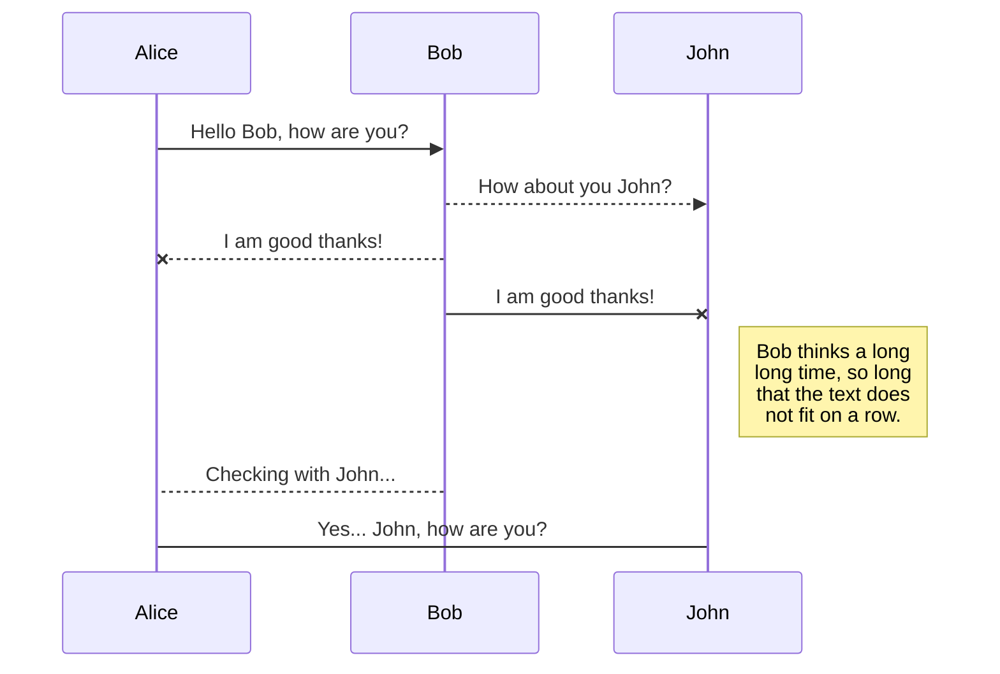
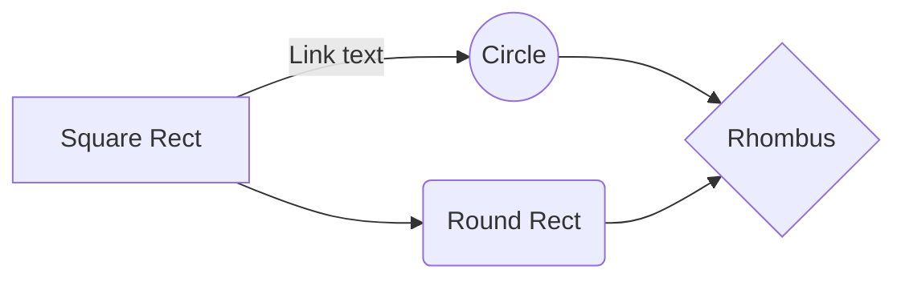

# MK Laravel Guideline

**الادوات المستخدمة والاصدارات**

 - Laragon 
 - PHP Storm IDE
 - PHP **8.1.10**
 - Laravel **9.4**

.  لانو بيجي فيه كلشي مثبت خالص مافي داعي نزل كل حزمة لحالها **laragon** استخدمت
  

**:في حال الاوامر ما اشتغلت معنا لازم نضيفها لمجلد الباث في الويندوز** 

 1. edit the system environment  variables
 2. environment  variables
 3. System variables -> Path -> Edit
 4. New -> Browse -> **.exe

# Laravel Commands

 - كود انشاء مشروع جديد
> composer create-project laravel/laravel app-name

- **artisan**كود يمكننا من خلاله معرفة جميع اوامر 
> php artisan 

- كود تشغيل السيرفر
> php artisan serve

- **Controller** كود انشاء 

> php artisan make:controller NameController

- **Resource Controller** كود انشاء 

> php artisan make:controller NameController -r 

## routes 

 هون الشغل بيعتمد على انشاء عنواين الوصول وربط العناوين مع الكونترولر  

-  طريقة كتابة الراوت البسيط
1.  **get** : هاد يستخدم عند التنقل بين الصفحات  

>

    Route::get('/users اسم المسار بالمتصفح', function (){   
		return view('users ملف البليد المراد عرضو');   	
    });

2.  **post** : **form** و **request** يستخدم لارسال البيانات  الى السيرفر وطبعا وقت ارسال البيانات لازم يكون في 

>

    Route::post('/users اسم المسار بالمتصفح', function (Request $request){   
		return $request;
    });
    
3. **get** with **parameter** :  **form** عن طريق اضافة المتغير بالمسار وبلا **get** هاد بخلينا نبعت بيانات باستخدام ال  

>

    Route::post('/users/{name}', function ($name){   
		return $name;
    });

## Blade system
   بنفس الصفحة **html** و اكواد ال **PHP**  هون بيتم كتابة اكواد ال 

**Examples :**

- Print  :
>

    {{$username}} 
    ----------------------------
    <?php echo ($usermname); ?>

- if else  :
>

	if ($username == 'samir'){
		    echo 'admin';	
	}  
	else {  
			echo 'user';  
	}
    ----------------------------
	@if ($username = 'samir')  
		  admin
	@else  
		  user  
	@endif

For more examples : https://laravel.com/docs/9.x/blade

**Extends :**

 هون فينا نساوي صفحة نحط فيها الاكواد المكررة ونستدعيها عالملف يلي بدنا ياه

- هاد كود ارفاق الصفحة يلي حنستدعي منها اكواد
>

     @extends('layout');
     
- هاد الكود يلي بينحط بصفحة الكود المكرر مشان تحديد المكان يلي حيطلع فيه السكشن
>

     @yield('content');

- هدول اكواد تحديد الفقرة يلي حنرفقها بالصفحة تبع الكود المكرر
>

     @section('content');
     
     @endsection	"or"	@stop

- هي في حالة صار بدنا نعمل تقنية الابن والاظهار
	

1. قمنا اول شي بكتابة هاد الكود بصفحة الكود المكرر	

>

	@section('sidebar')
			This is the side bar
	@show

2. هلا بنقوم باخذ الكود وعرضو بالصفحة يلي بدنا ياها
	- **parent** فينا نستدعي بس 
	-  مع اضافة اشياء **parent** فينا نستدعي 
	- **parent** فينا بس نضيف اشياء وما نستدعي 
>

	@section('sidebar')  
	@parent  
	<h1>Posts</h1>  
	@endsection

## Controller
داخل هاد بصير غالب واهم الشغل 
- **Controller** كود انشاء 

> php artisan make:controller NameController

- **CRUD** يستخدم هاد النمط اذا كان بدنا نعمل عملية او عمليات قليلة وما بنحتاج كامل ال 
- **Controller** لانشاء دالة بسيطة داخل 
>

	public function showUsers(){  
	    return 'users';  
	}
	
- عند كتابة راوتات كتيير عائدين لنفس الكونترولر فينا نكتب بالطريقة هي للاختصار  
>
		
	  ----------------------------الطريقة الطويلة------------------------------
		  
    Route::get('posts',[PostController::class,'showUsers']);  
	Route::get('posts/create',[PostController::class,'createPost']);  
	Route::get('posts/update/{id}',[PostController::class,'updatePost']);  
	Route::get('posts/edit/{id}',[PostController::class,'editPost']);  
	Route::get('posts/delete/{id}',[PostController::class,'deletePost']);
			
    ----------------------------الطريقة المختصرة------------------------------
		  
	Route::controller(PostController::class)->group(function (){  
	Route::get('posts','showUsers');  
	Route::get('posts/create','createPost');  
	Route::get('posts/update/{id}','updatePost');  
	Route::get('posts/edit/{id}','editPost');  
	Route::get('posts/delete/{id}','deletePost');  
	});

- **Resource Controller** كود انشاء 

> php artisan make:controller NameController -r 

- **Route** بشكل جاهز ويختصر علينا كتابة ال **CRUD** الفائدة من انشاء هذا النمط انه يقوم بانشاء عمليات ال 
- انشاء الراوت يكون بهي الطريقة 

>

	 Route::resource('/posts',PostController::class);
	    
-  **except  , only** و بدنا نفعل او نلغي راوت معين فينا نستخدم **CRUD** في حال كان بدنا ما نستعمل كامل عملية ال 
>

    Route::resource('/users',UserController::class)->except([  
	       'create', 'update', 'edit'  
    ]);

	Route::resource('/users',UserController::class)->only([  
		 'index' , 'create'  
	]);

## SmartPants

SmartyPants converts ASCII punctuation characters into "smart" typographic punctuation HTML entities. For example:

|                |ASCII                          |HTML                         |
|----------------|-------------------------------|-----------------------------|
|Single backticks|`'Isn't this fun?'`            |'Isn't this fun?'            |
|Quotes          |`"Isn't this fun?"`            |"Isn't this fun?"            |
|Dashes          |`-- is en-dash, --- is em-dash`|-- is en-dash, --- is em-dash|

## KaTeX

You can render LaTeX mathematical expressions using [KaTeX](https://khan.github.io/KaTeX/):

The *Gamma function* satisfying $\Gamma(n) = (n-1)!\quad\forall n\in\mathbb N$ is via the Euler integral

$$
\Gamma(z) = \int_0^\infty t^{z-1}e^{-t}dt\,.
$$

> You can find more information about **LaTeX** mathematical expressions [here](http://meta.math.stackexchange.com/questions/5020/mathjax-basic-tutorial-and-quick-reference).

## UML diagrams

You can render UML diagrams using [Mermaid](https://mermaidjs.github.io/). For example, this will produce a sequence diagram:

And this will produce a flow chart:

